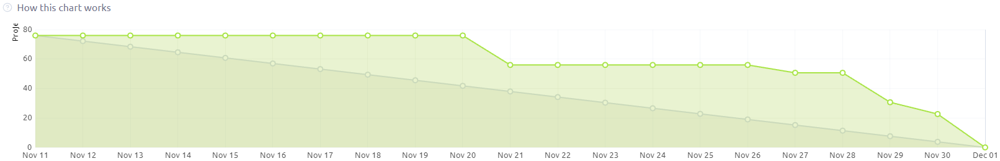

<h1 align='center'>
:boar: EQUIPE JAVALI :boar:

APRENDIZAGEM POR PROJETOS INTEGRADOS

4º SEMESTRE DSM - 2024-2
</h1>

<h1 align='center'> :keyboard:  :keyboard: </h1>

## :mag_right: Índice

    <a href="#objetivo">Objetivo da sprint</a> | 
    <a href="#backlog">Sprint Backlog</a> |
    <a href="#dor">DoR</a> |
    <a href="#dod">DoD</a> |
    <a href="#mvp">MVP da sprint</a> 

## :dart: Objetivo

    Para esta sprint, a equipe se compromete em entregar 

## :clipboard: Épicos

## Sprint Backlog

→ [Voltar ao topo](#topo)

## DoR - Definition of Ready

    Só poderemos iniciar as tarefas desta sprint caso todos os requisitados estiverem validados com o cliente.

→ [Voltar ao topo](#topo)  

## DoD - Definition of Done

    Esta sprint só estará completa, caso a equipe consiga finalizar todos os critérios de aceitação de cada história de usuário. Também contando com a passagem nos testes e validação do cliente.

→ [Voltar ao topo](#topo)

## Burndown da Sprint

## MVP da Sprint

→ [Voltar ao topo](#topo)
